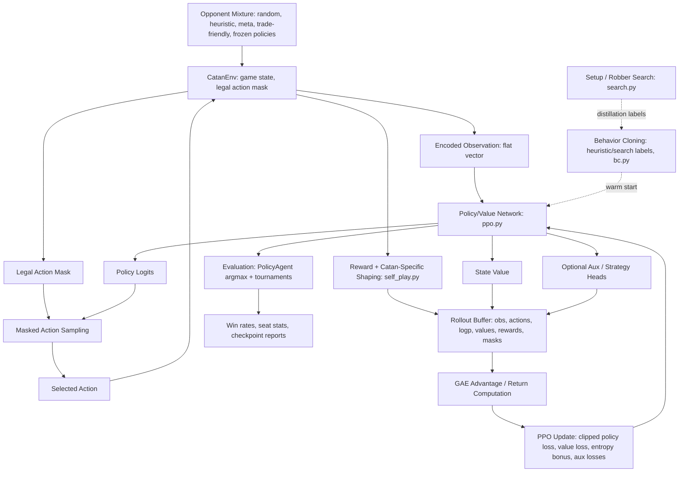
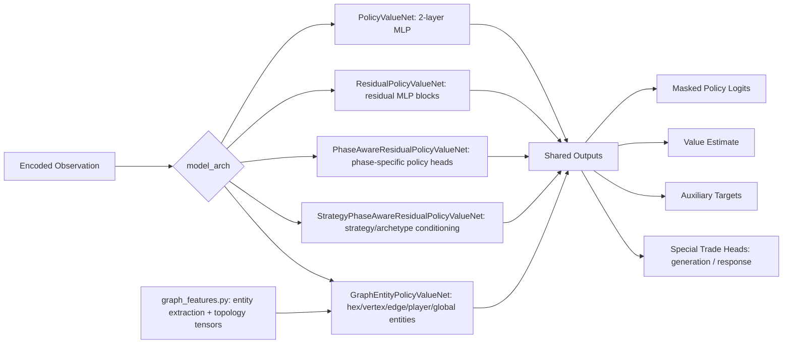

# RL Deep Learning Architecture

## Training Flow

```mermaid
flowchart TD
    Env[CatanEnv: game state, legal action mask] --> Obs[Encoded Observation: flat vector]
    Env --> Mask[Legal Action Mask]

    Obs --> Model[Policy/Value Network: ppo.py]
    Mask --> PPOAct[Masked Action Sampling]

    Model --> Policy[Policy Logits]
    Model --> Value[State Value]
    Model --> Aux[Optional Aux / Strategy Heads]

    Policy --> PPOAct
    PPOAct --> Action[Selected Action]
    Action --> Env

    Env --> Reward[Reward + Catan-Specific Shaping: self_play.py]
    Reward --> Rollout[Rollout Buffer: obs, actions, logp, values, rewards, masks]
    Value --> Rollout
    Aux --> Rollout

    Rollout --> GAE[GAE Advantage / Return Computation]
    GAE --> PPOUpdate[PPO Update: clipped policy loss, value loss, entropy bonus, aux losses]

    PPOUpdate --> Model

    BC[Behavior Cloning: heuristic/search labels, bc.py] -. warm start .-> Model
    Search[Setup / Robber Search: search.py] -. distillation labels .-> BC

    Model --> Eval[Evaluation: PolicyAgent argmax + tournaments]
    Eval --> Reports[Win rates, seat stats, checkpoint reports]

    OppMix[Opponent Mixture: random, heuristic, meta, trade-friendly, frozen policies] --> Env
```

## Model Families

```mermaid
flowchart LR
    Obs[Encoded Observation] --> Arch{model_arch}

    Arch --> MLP[PolicyValueNet: 2-layer MLP]
    Arch --> Res[ResidualPolicyValueNet: residual MLP blocks]
    Arch --> Phase[PhaseAwareResidualPolicyValueNet: phase-specific policy heads]
    Arch --> Strat[StrategyPhaseAwareResidualPolicyValueNet: strategy/archetype conditioning]
    Arch --> Graph[GraphEntityPolicyValueNet: hex/vertex/edge/player/global entities]

    GraphFeatures[graph_features.py: entity extraction + topology tensors] --> Graph

    MLP --> Heads[Shared Outputs]
    Res --> Heads
    Phase --> Heads
    Strat --> Heads
    Graph --> Heads

    Heads --> Policy[Masked Policy Logits]
    Heads --> Value[Value Estimate]
    Heads --> Aux[Auxiliary Targets]
    Heads --> Trade[Special Trade Heads: generation / response]
```
